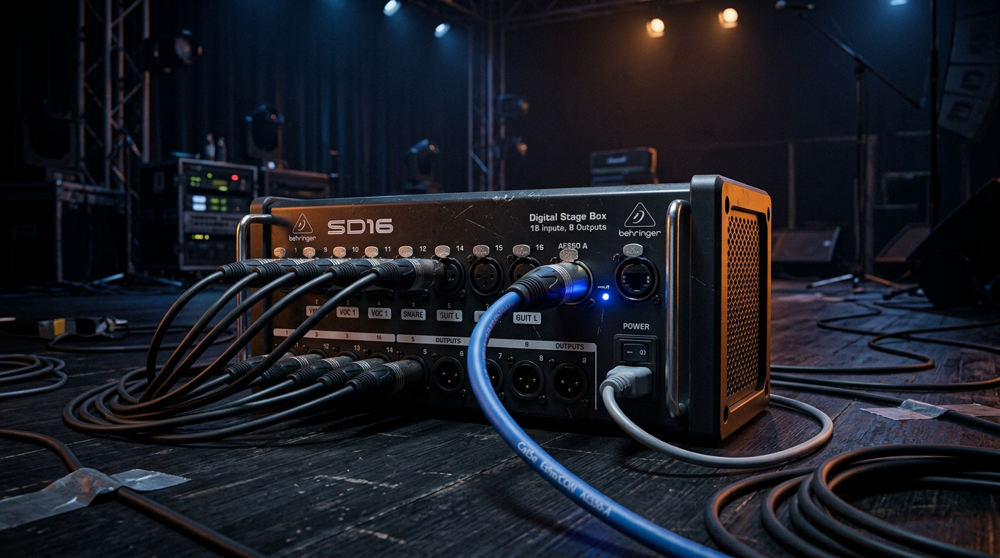
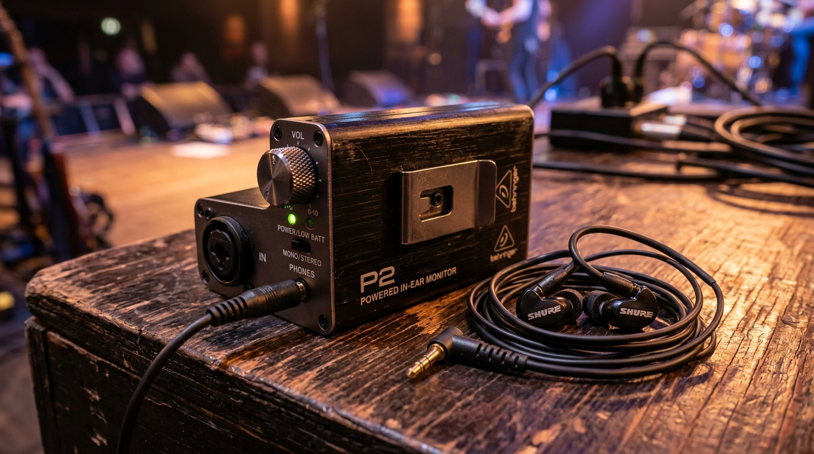

<!-- _class: lead -->

# 100만 원 예산 기반 세션 모니터링 시스템 구축안

## 베링거 X32 + SD16 스테이지박스 & P2 유선 인이어 시스템

음향 파트 담당자 보고 자료
2026년 7월 (2차 수정본)

---

## 1. 도입 배경 및 해결 과제

- **무대 노이즈 격리**: Wedge 모니터 스피커의 고음압 저음이 FOH 메인 스피커와 위상 간섭(Comb Filtering)을 일으켜 전체 명료도를 떨어뜨리는 현상 해결.
- **하울링(피드백) 루프 차단**: 무대 확성 스피커를 없애고 귀 내부 밀폐형 인이어를 사용하여 피드백 마진을 극대화.
- **개별 모니터 품질 보장**: 세션(드럼, 베이스, 건반, 보컬)들이 본인 연주와 화음에만 집중할 수 있는 쾌적한 스테레오 정위감 확보.
- **청력 안전 대책 수립**: 돌발 피크 노이즈로부터 청각 신경을 보호하기 위한 리미터 셋업 및 안정적 젠더 규격 통일.

---

## 2. 16채널 스테이지박스 비교 분석

| 분류 | 베링거 SD16 (추천) | 베링거 S16 | 마이더스 DL16 |
|---|---|---|---|
| **입력단자** | **16 Ch (Combo XLR/TRS 겸용)** | 16 Ch (XLR 전용) | 16 Ch (XLR 전용) |
| **출력단자** | 8 Ch (XLR) | 8 Ch (XLR) | 8 Ch (XLR) |
| **울트라넷** | **4개 포트 (허브 내장 / PoE 지원)** | 1개 포트 (단선 아웃) | 1개 포트 (단선 아웃) |
| **프리앰프** | Midas Designed | Midas Designed | **Midas PRO 프리앰프** |
| **신품가** | **648,000원** | 약 110만 원 | 약 150만 원 |
| **중고시세** | **약 45만 원** | 약 65만 원 | 약 110만 원 |

- **SD16 선택 이유**: 콤보 잭 탑재로 악기 직결 시 **DI Box 예산 절감**, 4개 울트라넷 허브 내장으로 **P16-D 분배기 도입 비용(약 30만 원) 원천 세이브**.

---

## 3. 추천 하드웨어 구성

  
  

좌: 무대 콤보 입력 및 8개의 아웃풋, 4포트 울트라넷 허브를 탑재한 **베링거 SD16 스테이지박스**
우: XLR 입력 및 모노/스테레오 모드 전환이 가능한 **베링거 P2 벨트팩 헤드폰 앰프**

---

## 4. ⚠️ 핵심 기술 가이드라인

- **물리적 신호 흐름**:
  - X32 콘솔 ➔ (AES50 디지털 전송) ➔ **SD16 스테이지박스**
  - SD16 아날로그 OUT 1~8 ➔ (XLR 마이크 케이블) ➔ **P2 인풋** ➔ (3.5mm) ➔ 개인 이어폰
- **P2의 신호 규격 매칭**:
  - P2는 울트라넷 디지털 수신기가 아닌 **아날로그 앰프**이므로 스테이지박스의 **아날로그 XLR Out단**에 연결해야 합니다.
  - 모노 전송 시 반드시 **P2 내부 스위치를 MONO로 지정**하여 역위상 캔슬(Out of Phase)로 인한 저음 실종 및 음량 저하 현상을 예방합니다.
- **디지털 통신선 접지(STP)**:
  - 콘솔과 SD16 간 AES50 연결 케이블은 정전기 노이즈 뮤트 현상을 피하기 위해 반드시 **STP(Shielded) 규격 및 메탈 쉘(Shell) 접지 랜케이블**을 사용합니다.

---

## 5. 100만 원 예산안 집행 기획서 (4인조 세션 기준)

| 구분 | 품명 및 세부 사양 | 수량 | 신품 단가 | 중고 단가 | 집행 금액 | 비고 |
|---|---|:---:|:---:|:---:|:---:|---|
| **장비** | 베링거 SD16 스테이지박스 | 1 | 648,000 | — | **648,000** | 신품 구입 (최저가 반영) |
| **장비** | 베링거 P2 유선 인이어 앰프 | 4 | 65,000 | 40,000 | **160,000** | 중고 구입 또는 할인 구매 |
| **선재** | LS전선 Cat5e EtherCON (30m) | 1 | 65,000 | — | **65,000** | 신품 (접지/쉴딩 차폐 필수) |
| **선재** | 카나레 XLR(F)-XLR(M) 10m | 4 | 15,000 | — | **60,000** | 신품 (SD16 - P2 연결용) |
| **합계** | **스테이지 박스 + P2 4세트 구축** | | | | **933,000 원** | **예산 안 안착 (약 6만 7천 원 절감)** |

※ 신품 SD16 스테이지박스 도입 및 4인의 P2 인이어 모니터링 시스템을 100만 원 예산 이내로 완전 구축 가능.

---

## 6. 시스템 구축 단계 및 로드맵

- **1단계: 인프라 구축 (현재)**
  - X32 ➔ SD16 연결 및 무대 16채널 입력 포트 확보.
  - SD16 아날로그 아웃풋(8개 포트)을 활용해 4~6개의 P2 모니터 라인 구동.
- **2단계: 디지털 확장 (향후 예산 확보 시)**
  - SD16에 내장된 **4포트 울트라넷 허브**를 활용하여 인도자 및 주요 악기용 **P16-M 개인 디지털 믹서** 도입.
  - P16-M 도입 시 P2는 개인 믹서의 헤드폰 출력단에 직결하여 사용하므로 기존 구매 자산(P2) 100% 재활용 가능.

---

<!-- _class: lead -->

# 감사합니다

## Q&A

<!--
PDF 변환: npx @marp-team/marp-cli --pdf --allow-local-files 05_IEM_System_Budget_Presentation.md
HTML 변환: npx @marp-team/marp-cli --html --allow-local-files 05_IEM_System_Budget_Presentation.md
-->
